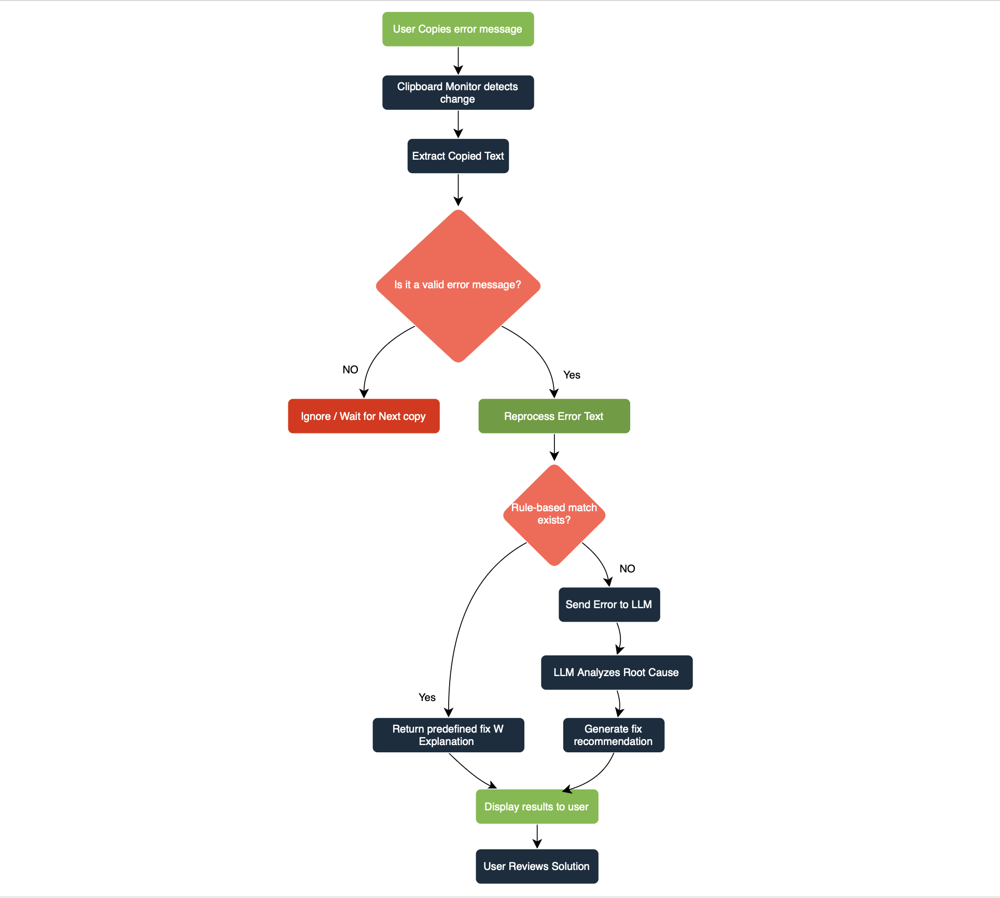

# AI clipboard Error assistant 

## + Overview +
This Project is a a clipboard-based **AI error diagnosis assistant** that detects copied error messages, analyzes root causes, and provides real-time fix recommendations to streamline debugging workflows.

I use a **hybrid diagnosis approach**
- Deterministic rule-based matching for common known errors
- LLM fallback for less predictable or unfamiliar failures.

>Status: Currently in development (architecture and design phase)

## + System Flow +

